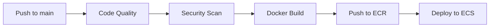

# 🏢 Dernek ERP Backend

Dernek yönetim sistemi için geliştirilmiş kapsamlı RESTful API servisleri. Node.js, Express.js, PostgreSQL ve modern web teknolojileri kullanılarak geliştirilmiştir.

---

## 📋 İçindekiler

- [Proje Hakkında](#-proje-hakkında)
- [Temel Özellikler](#-temel-özellikler)
- [Teknolojiler](#-teknolojiler)
- [Proje Yapısı](#-proje-yapısı)
- [Hızlı Başlangıç](#-hızlı-başlangıç)
- [Manuel Kurulum](#-manuel-kurulum)
- [Docker ile Kurulum](#-docker-ile-kurulum)
- [Environment Değişkenleri](#-environment-değişkenleri)
- [API Endpoint'leri](#-api-endpointleri)
- [Veritabanı Modelleri](#-veritabanı-modelleri)
- [Geliştirme Rehberi](#-geliştirme-rehberi)
- [CI/CD Pipeline](#-cicd-pipeline)
- [Sık Sorulan Sorular](#-sık-sorulan-sorular)

---

## 🎯 Proje Hakkında

Bu proje, dernek yönetim süreçlerini dijitalleştirmek ve otomatikleştirmek amacıyla geliştirilmiş bir ERP (Enterprise Resource Planning) sisteminin backend kısmıdır. Üye yönetimi, aidat takibi, bağış yönetimi, etkinlik organizasyonu, finansal işlemler ve WhatsApp entegrasyonu gibi kapsamlı işlevleri sağlar.

### 🌟 Temel Özellikler

| Özellik | Açıklama |
|---------|----------|
| 👤 **Üye Yönetimi** | Kayıt, güncelleme, silme ve detaylı üye profilleri |
| 👥 **Grup Yönetimi** | Üye grupları oluşturma ve yönetme |
| 💰 **Bağış Sistemi** | Bağış kampanyaları ve bağış takibi |
| 📊 **Finans Modülü** | Aidat, borç ve tahsilat yönetimi |
| 📅 **Etkinlik Yönetimi** | Etkinlik oluşturma ve takibi |
| 📱 **WhatsApp Entegrasyonu** | Toplu mesaj gönderme ve grup yönetimi |
| 🔐 **Kimlik Doğrulama** | JWT tabanlı güvenli giriş sistemi |
| 🛡️ **Yetkilendirme** | Modül bazlı izin sistemi |

---

## 🛠 Teknolojiler

### Backend Teknolojileri
- **Node.js** (v20+) - JavaScript runtime ortamı
- **Express.js** (v5.1.0) - Hızlı ve minimal web framework
- **Sequelize** (v6.37.7) - Güçlü ORM (Object-Relational Mapping)
- **PostgreSQL** - Kurumsal düzey veritabanı
- **Socket.IO** (v4.8.1) - Gerçek zamanlı iletişim

### Güvenlik & Middleware
- **Helmet** - HTTP güvenlik başlıkları
- **CORS** - Cross-Origin Resource Sharing yapılandırması
- **bcrypt** (v6.0.0) - Güvenli şifre hashleme
- **jsonwebtoken** (v9.0.3) - JWT token yönetimi
- **dotenv** - Environment variables yönetimi

### Özel Entegrasyonlar
- **whatsapp-web.js** (v1.34.1) - WhatsApp Web API entegrasyonu
- **qrcode-terminal** - QR kod görüntüleme

### Geliştirme Araçları
- **Nodemon** (v3.0.0) - Hot reload ile geliştirme
- **ESLint** (v9.37.0) - Kod kalitesi kontrolü
- **Sequelize CLI** (v6.6.3) - Migrasyon yönetimi
- **Docker & Docker Compose** - Containerization

---

## 📁 Proje Yapısı

```
dernek-erp-backend/
│
├── 📂 .github/
│   └── workflows/
│       └── main.yml              # CI/CD pipeline (GitHub Actions)
│
├── 📂 config/
│   └── config.json               # Sequelize CLI konfigürasyonu
│
├── 📂 migrations/                # Veritabanı migrasyonları
│
├── 📂 src/                       # Ana kaynak kodları
│   │
│   ├── 📂 config/
│   │   └── database.js           # PostgreSQL/Sequelize bağlantısı
│   │
│   ├── 📂 controllers/           # HTTP istek kontrolcüleri
│   │   ├── auth.controller.js    # Kimlik doğrulama işlemleri
│   │   ├── member.controller.js  # Üye işlemleri
│   │   ├── group.controller.js   # Grup işlemleri
│   │   ├── donation.controller.js # Bağış işlemleri
│   │   ├── donor.controller.js   # Bağışçı işlemleri
│   │   ├── event.controller.js   # Etkinlik işlemleri
│   │   ├── finance.controller.js # Finans işlemleri
│   │   └── whatsapp.controller.js # WhatsApp işlemleri
│   │
│   ├── 📂 models/                # Sequelize modelleri
│   │   ├── index.js              # Model birleştirici
│   │   ├── admin.model.js        # Admin kullanıcı modeli
│   │   ├── member.model.js       # Üye modeli
│   │   ├── group.model.js        # Grup modeli
│   │   ├── donation.model.js     # Bağış modeli
│   │   ├── donationCampaign.model.js # Bağış kampanyası modeli
│   │   ├── donor.model.js        # Bağışçı modeli
│   │   ├── event.model.js        # Etkinlik modeli
│   │   ├── debt.model.js         # Borç modeli
│   │   ├── collection.model.js   # Tahsilat modeli
│   │   └── externalDebtor.model.js # Harici borçlu modeli
│   │
│   ├── 📂 services/              # İş mantığı servisleri
│   │   ├── auth.service.js       # Kimlik doğrulama servisi
│   │   ├── member.service.js     # Üye servisi
│   │   ├── group.service.js      # Grup servisi
│   │   ├── donation.service.js   # Bağış servisi
│   │   ├── donor.service.js      # Bağışçı servisi
│   │   ├── event.service.js      # Etkinlik servisi
│   │   ├── finance.service.js    # Finans servisi
│   │   └── whatsapp.service.js   # WhatsApp servisi
│   │
│   ├── 📂 repositories/          # Veri erişim katmanı
│   │   ├── member.repository.js
│   │   └── group.repository.js
│   │
│   ├── 📂 routes/                # API route tanımları
│   │   ├── index.js              # Ana route birleştirici
│   │   ├── auth.routes.js        # /api/auth
│   │   ├── member.routes.js      # /api/members
│   │   ├── group.routes.js       # /api/groups
│   │   ├── donation.routes.js    # /api/donations
│   │   ├── donor.routes.js       # /api/donors
│   │   ├── event.routes.js       # /api/events
│   │   ├── finance.routes.js     # /api/finance
│   │   └── whatsapp.routes.js    # /api/whatsapp
│   │
│   ├── 📂 middlewares/           # Özel middleware'ler
│   │   ├── authMiddleware.js     # JWT doğrulama & yetkilendirme
│   │   └── errorHandler.js       # Merkezi hata yönetimi
│   │
│   ├── 📂 utils/                 # Yardımcı fonksiyonlar
│   │   └── whatsappClient.js     # WhatsApp client yönetimi
│   │
│   └── 📂 constants/             # Sabit değerler
│
├── app.js                        # Express uygulama konfigürasyonu
├── server.js                     # HTTP server & Socket.IO başlatma
├── package.json                  # NPM bağımlılıkları ve scriptler
├── dockerfile                    # Docker imaj tanımı
├── docker-compose.yaml           # Multi-container Docker setup
├── .env.example                  # Environment variables şablonu
├── .sequelizerc                  # Sequelize CLI konfigürasyonu
└── .gitignore                    # Git ignore kuralları
```

---

## 🚀 Hızlı Başlangıç

### Ön Gereksinimler

Projeyi çalıştırmadan önce aşağıdaki yazılımların sisteminizde kurulu olduğundan emin olun:

| Yazılım | Minimum Versiyon | İndirme Linki |
|---------|------------------|---------------|
| **Node.js** | v20.0.0+ | [nodejs.org](https://nodejs.org/) |
| **npm** | v9.0.0+ | Node.js ile birlikte gelir |
| **PostgreSQL** | v14.0+ | [postgresql.org](https://www.postgresql.org/) |
| **Docker** (opsiyonel) | v20.0.0+ | [docker.com](https://www.docker.com/) |
| **Git** | v2.0.0+ | [git-scm.com](https://git-scm.com/) |

### Kurulum Yöntemleri

Projeyi çalıştırmak için iki yöntem bulunmaktadır:

1. **🐳 Docker ile Kurulum** (Önerilen) - Tüm bağımlılıklar otomatik kurulur
2. **💻 Manuel Kurulum** - Yerel makinede adım adım kurulum

---

## 💻 Manuel Kurulum

### Adım 1: Projeyi Klonlayın

```bash
# Repository'yi klonlayın
git clone https://github.com/username/dernek-erp-backend.git

# Proje dizinine gidin
cd dernek-erp-backend
```

### Adım 2: Bağımlılıkları Yükleyin

```bash
# Tüm npm paketlerini yükleyin
npm install
```

> 💡 **İpucu:** Eğer yükleme sırasında bcrypt ile ilgili hata alırsanız, sisteminizde Python ve C++ build tools'un yüklü olduğundan emin olun.

### Adım 3: PostgreSQL Veritabanını Kurun

#### Windows için:
1. [PostgreSQL Installer](https://www.postgresql.org/download/windows/) indirin ve kurun
2. Kurulum sırasında belirlediğiniz şifreyi not alın
3. pgAdmin veya psql ile yeni bir veritabanı oluşturun:

```sql
-- PostgreSQL'e bağlanın
psql -U postgres

-- Yeni kullanıcı oluşturun
CREATE USER dernekuser WITH PASSWORD 'dernekpass';

-- Yeni veritabanı oluşturun
CREATE DATABASE dernek_erp_db;

-- Yetkiler verin
GRANT ALL PRIVILEGES ON DATABASE dernek_erp_db TO dernekuser;
```

#### macOS için:
```bash
# Homebrew ile PostgreSQL kurun
brew install postgresql@15

# Servisi başlatın
brew services start postgresql@15

# Veritabanı oluşturun
createdb dernek_erp_db
```

#### Linux (Ubuntu/Debian) için:
```bash
# PostgreSQL kurun
sudo apt update
sudo apt install postgresql postgresql-contrib

# PostgreSQL servisini başlatın
sudo systemctl start postgresql
sudo systemctl enable postgresql

# postgres kullanıcısına geçin
sudo -u postgres psql

# Veritabanı ve kullanıcı oluşturun
CREATE USER dernekuser WITH PASSWORD 'dernekpass';
CREATE DATABASE dernek_erp_db OWNER dernekuser;
\q
```

### Adım 4: Environment Değişkenlerini Ayarlayın

Proje kök dizininde `.env` dosyası oluşturun:

```bash
# .env dosyası oluşturun
touch .env  # Linux/macOS
# veya Windows için: type nul > .env
```

Aşağıdaki içeriği `.env` dosyasına ekleyin:

```env
# Server Konfigürasyonu
PORT=8080
NODE_ENV=development

# PostgreSQL Veritabanı Bağlantısı
DB_HOST=localhost
DB_PORT=5432
DB_USER=dernekuser
DB_PASSWORD=dernekpass
DB_NAME=dernek_erp_db

# JWT Secret Key (Güvenli ve uzun bir key kullanın)
JWT_SECRET=your-super-secret-jwt-key-change-this-in-production

# JWT Token Süresi (opsiyonel)
JWT_EXPIRES_IN=24h
```

> ⚠️ **Önemli:** Production ortamında `JWT_SECRET` değerini güçlü ve benzersiz bir değer ile değiştirin!

### Adım 5: Veritabanı Migrasyonlarını Çalıştırın

```bash
# Migrasyonların durumunu kontrol edin
npm run migrate:status

# Migrasyonları uygulayın
npm run migrate

# (Opsiyonel) Örnek verileri ekleyin
npm run seed
```

### Adım 6: Uygulamayı Başlatın

```bash
# Development modunda başlatın (hot reload aktif)
npm run dev

# veya Production modunda başlatın
npm start
```

Başarılı bir başlatma sonrasında aşağıdaki mesajları görmelisiniz:

```
✅ PostgreSQL bağlantısı başarılı
✅ Sequelize veritabanı bağlantısı başarılı!
✅ Server çalışıyor: 8080
✅ Socket.IO aktif
```

### Adım 7: Bağlantıyı Test Edin

Tarayıcınızda veya Postman/curl ile test edin:

```bash
# Health check (herhangi bir endpoint)
curl http://localhost:8080/api/auth/login
```

---

## 🐳 Docker ile Kurulum

Docker ile kurulum, tüm bağımlılıkların (PostgreSQL dahil) otomatik olarak kurulmasını sağlar. **Bu yöntem önerilir.**

### Adım 1: Projeyi Klonlayın

```bash
git clone https://github.com/username/dernek-erp-backend.git
cd dernek-erp-backend
```

### Adım 2: Docker Compose ile Çalıştırın

```bash
# Tüm servisleri arka planda başlatın
docker-compose up -d

# Logları takip edin
docker-compose logs -f
```

Bu komut aşağıdaki servisleri başlatacaktır:

| Servis | Container Adı | Port | Açıklama |
|--------|---------------|------|----------|
| **PostgreSQL** | postgres_db | 5432 | Veritabanı sunucusu |
| **API** | dernek-erp-api | 8000 → 8080 | Node.js backend |

> 📌 **Not:** API servisi `localhost:8000` üzerinden erişilebilir (container içinde 8080 portunda çalışır)

### Docker Ortam Değişkenleri

Docker Compose otomatik olarak aşağıdaki environment değişkenlerini ayarlar:

```yaml
# docker-compose.yaml içinde tanımlı
DB_HOST: db
DB_PORT: 5432
DB_USER: dernekuser
DB_PASSWORD: dernekpass
DB_NAME: dernek_erp_db
```

### Yararlı Docker Komutları

```bash
# Servisleri başlat
docker-compose up -d

# Servisleri durdur
docker-compose down

# Servisleri ve volume'ları temizle (VERİ SİLİNİR!)
docker-compose down -v

# Container loglarını izle
docker-compose logs -f api
docker-compose logs -f db

# API container'ına bağlan
docker-compose exec api sh

# Veritabanı container'ına bağlan
docker-compose exec db psql -U dernekuser -d dernek_erp_db

# İmajları yeniden build et
docker-compose build --no-cache

# Geliştirme modu (dosya değişikliklerini izler)
docker-compose watch
```

---

## 🔐 Environment Değişkenleri

| Değişken | Zorunlu | Varsayılan | Açıklama |
|----------|---------|------------|----------|
| `PORT` | Hayır | 8080 | Server port numarası |
| `NODE_ENV` | Hayır | development | Ortam (development/production) |
| `DB_HOST` | Evet | db | PostgreSQL sunucu adresi |
| `DB_PORT` | Hayır | 5432 | PostgreSQL port numarası |
| `DB_USER` | Evet | - | Veritabanı kullanıcı adı |
| `DB_PASSWORD` | Evet | - | Veritabanı şifresi |
| `DB_NAME` | Evet | - | Veritabanı adı |
| `JWT_SECRET` | Evet | - | JWT token imzalama anahtarı |
| `JWT_EXPIRES_IN` | Hayır | 24h | Token geçerlilik süresi |

---

## 📡 API Endpoint'leri

Tüm API endpoint'leri `/api` prefix'i ile başlar.

### 🔐 Kimlik Doğrulama (`/api/auth`)

| Metod | Endpoint | Açıklama | Yetki |
|-------|----------|----------|-------|
| POST | `/api/auth/register` | Yeni admin kaydı | - |
| POST | `/api/auth/login` | Giriş yapma | - |
| GET | `/api/auth/admins` | Tüm adminleri listele | Admin |
| GET | `/api/auth/admins/:id` | Admin detayı | Admin |
| PUT | `/api/auth/admins/:id` | Admin güncelle | Admin |
| DELETE | `/api/auth/admins/:id` | Admin sil | Admin |

### 👤 Üyeler (`/api/members`)

| Metod | Endpoint | Açıklama |
|-------|----------|----------|
| GET | `/api/members` | Tüm üyeleri listele |
| GET | `/api/members/:id` | Üye detayı |
| POST | `/api/members` | Yeni üye ekle |
| PUT | `/api/members/:id` | Üye güncelle |
| DELETE | `/api/members/:id` | Üye sil |

### 👥 Gruplar (`/api/groups`)

| Metod | Endpoint | Açıklama |
|-------|----------|----------|
| GET | `/api/groups` | Tüm grupları listele |
| GET | `/api/groups/:id` | Grup detayı |
| POST | `/api/groups` | Yeni grup oluştur |
| PUT | `/api/groups/:id` | Grup güncelle |
| DELETE | `/api/groups/:id` | Grup sil |

### 💰 Bağışlar (`/api/donations`)

| Metod | Endpoint | Açıklama |
|-------|----------|----------|
| GET | `/api/donations` | Tüm bağışları listele |
| POST | `/api/donations` | Yeni bağış ekle |

### 🙋 Bağışçılar (`/api/donors`)

| Metod | Endpoint | Açıklama |
|-------|----------|----------|
| GET | `/api/donors` | Tüm bağışçıları listele |
| POST | `/api/donors` | Yeni bağışçı ekle |

### 📅 Etkinlikler (`/api/events`)

| Metod | Endpoint | Açıklama |
|-------|----------|----------|
| GET | `/api/events` | Tüm etkinlikleri listele |
| POST | `/api/events` | Yeni etkinlik oluştur |

### 💳 Finans (`/api/finance`)

| Metod | Endpoint | Açıklama |
|-------|----------|----------|
| GET | `/api/finance/debts` | Borçları listele |
| POST | `/api/finance/debts` | Yeni borç ekle |
| GET | `/api/finance/collections` | Tahsilatları listele |
| POST | `/api/finance/collections` | Yeni tahsilat ekle |

### 📱 WhatsApp (`/api/whatsapp`)

| Metod | Endpoint | Açıklama |
|-------|----------|----------|
| GET | `/api/whatsapp/status` | Bağlantı durumu |
| GET | `/api/whatsapp/groups` | WhatsApp gruplarını listele |
| POST | `/api/whatsapp/send` | Mesaj gönder |

---

## 🗃️ Veritabanı Modelleri

### Admin (Yönetici)
```javascript
{
  id: UUID,
  name: STRING,
  surname: STRING,
  email: STRING (unique),
  phone: STRING,
  password: STRING (hashed),
  permissions: {
    member: BOOLEAN,
    donation: BOOLEAN,
    admin: BOOLEAN,
    event: BOOLEAN,
    meeting: BOOLEAN,
    socialMedia: BOOLEAN,
    financial: BOOLEAN,
    documentManagement: BOOLEAN
  },
  notes: TEXT
}
```

### Member (Üye)
```javascript
{
  id: UUID,
  firstName: STRING,
  lastName: STRING,
  email: STRING,
  phone: STRING,
  address: TEXT,
  membershipDate: DATE,
  status: ENUM('active', 'passive'),
  groupId: UUID (FK)
}
```

### Group (Grup)
```javascript
{
  id: UUID,
  name: STRING,
  description: TEXT
}
```

### Donation (Bağış)
```javascript
{
  id: UUID,
  amount: DECIMAL,
  date: DATE,
  donorId: UUID (FK),
  campaignId: UUID (FK)
}
```

---

## 🔧 Geliştirme Rehberi

### Proje Mimarisi

Bu proje **Layered Architecture** (Katmanlı Mimari) prensibi ile yapılandırılmıştır:

```
┌─────────────────────────────────────────┐
│              ROUTES                      │  ← API endpoint tanımları
├─────────────────────────────────────────┤
│            CONTROLLERS                   │  ← HTTP istek/yanıt yönetimi
├─────────────────────────────────────────┤
│             SERVICES                     │  ← İş mantığı
├─────────────────────────────────────────┤
│           REPOSITORIES                   │  ← Veri erişim katmanı
├─────────────────────────────────────────┤
│              MODELS                      │  ← Veritabanı şemaları
└─────────────────────────────────────────┘
```

### Yeni Özellik Ekleme

Yeni bir modül eklemek için aşağıdaki sırayı takip edin:

#### 1. Model Oluşturun (`src/models/`)
```javascript
// src/models/example.model.js
import { DataTypes } from 'sequelize';

export default (sequelize) => {
  const Example = sequelize.define('Example', {
    id: {
      type: DataTypes.UUID,
      defaultValue: DataTypes.UUIDV4,
      primaryKey: true,
    },
    name: {
      type: DataTypes.STRING,
      allowNull: false,
    },
  });

  return Example;
};
```

#### 2. Service Yazın (`src/services/`)
```javascript
// src/services/example.service.js
import db from '../models/index.js';

export const getAll = async () => {
  return await db.Example.findAll();
};

export const create = async (data) => {
  return await db.Example.create(data);
};
```

#### 3. Controller Tanımlayın (`src/controllers/`)
```javascript
// src/controllers/example.controller.js
import * as ExampleService from '../services/example.service.js';

export const getAll = async (req, res, next) => {
  try {
    const examples = await ExampleService.getAll();
    res.json({ success: true, data: examples });
  } catch (error) {
    next(error);
  }
};
```

#### 4. Route Ekleyin (`src/routes/`)
```javascript
// src/routes/example.routes.js
import express from 'express';
import * as ExampleController from '../controllers/example.controller.js';

const router = express.Router();

router.get('/', ExampleController.getAll);
router.post('/', ExampleController.create);

export default router;
```

#### 5. Ana Route'a Bağlayın (`src/routes/index.js`)
```javascript
import exampleRoutes from './example.routes.js';
router.use("/examples", exampleRoutes);
```

### Kod Standartları

- ✅ ES6+ modules kullanın (`import/export`)
- ✅ Async/await tercih edin
- ✅ Error handling implementasyonu yapın
- ✅ Sequelize validasyonları kullanın
- ✅ ESLint kurallarına uyun

```bash
# Kod kalitesi kontrolü
npm run lint
```

### NPM Script'leri

| Script | Komut | Açıklama |
|--------|-------|----------|
| `start` | `npm start` | Production modunda başlat |
| `dev` | `npm run dev` | Development modunda başlat (hot reload) |
| `lint` | `npm run lint` | ESLint ile kod kontrolü |
| `migrate` | `npm run migrate` | Migrasyonları uygula |
| `migrate:undo` | `npm run migrate:undo` | Son migrasyonu geri al |
| `migrate:status` | `npm run migrate:status` | Migrasyon durumunu göster |
| `seed` | `npm run seed` | Örnek verileri ekle |

---

## 🔄 CI/CD Pipeline

GitHub Actions kullanılarak otomatik CI/CD pipeline kurulmuştur.

### Pipeline Aşamaları



| Aşama | Açıklama |
|-------|----------|
| **Code Quality** | Bağımlılıkları yükle ve ESLint kontrolü |
| **Security Scan** | npm audit ve güvenlik taraması |
| **Docker Build** | Docker imajı oluştur |
| **Push to ECR** | AWS ECR'a imaj yükle |
| **Deploy to ECS** | AWS ECS Fargate'e dağıt |

### Tetikleyiciler

- `main` branch'e push
- Haftalık otomatik security scan (Pazar 00:00 UTC)

### GitHub Secrets

CI/CD için aşağıdaki secrets'ların tanımlı olması gerekir:

- `AWS_ACCESS_KEY_ID`
- `AWS_SECRET_ACCESS_KEY`
- `ECR_REGISTRY`
- `ECS_TASK_FAMILY`
- `ECS_SERVICE_NAME`
- `DB_HOST`, `DB_USER`, `DB_PASSWORD`, `DB_NAME`

---

## ❓ Sık Sorulan Sorular

### 1. "ECONNREFUSED" hatası alıyorum

```
Error: connect ECONNREFUSED 127.0.0.1:5432
```

**Çözüm:** PostgreSQL servisinin çalıştığından emin olun:
```bash
# Linux
sudo systemctl start postgresql

# macOS
brew services start postgresql@15

# Windows
net start postgresql-x64-15
```

### 2. bcrypt kurulum hatası

**Çözüm:** Windows için:
```bash
npm install --global windows-build-tools
npm install bcrypt
```

### 3. WhatsApp QR kodu görünmüyor

**Çözüm:** Docker kullanıyorsanız, frontend uygulaması üzerinden Socket.IO bağlantısı ile QR kodunu alabilirsiniz. Terminal'de QR kodu sadece lokal çalıştırmada görünür.

### 4. Port 8080 zaten kullanılıyor

**Çözüm:** `.env` dosyasında farklı bir port belirleyin:
```env
PORT=3000
```

### 5. Docker container başlamıyor

**Çözüm:** Logları kontrol edin ve container'ları yeniden oluşturun:
```bash
docker-compose logs api
docker-compose down
docker-compose build --no-cache
docker-compose up -d
```

---

## 📝 Commit Mesaj Formatı

```
<type>(<scope>): <description>

[optional body]

[optional footer(s)]
```

**Tip örnekleri:**
- `feat`: Yeni özellik
- `fix`: Bug düzeltmesi
- `docs`: Dokümantasyon
- `style`: Kod formatı (fonksiyonel olmayan)
- `refactor`: Kod iyileştirmesi
- `test`: Test ekleme/düzeltme
- `chore`: Build, konfigürasyon vb.

---

## 📄 Lisans

Bu proje ISC lisansı altında lisanslanmıştır.

---

## 🤝 Katkıda Bulunma

1. Fork yapın
2. Feature branch oluşturun (`git checkout -b feature/amazing-feature`)
3. Değişikliklerinizi commit edin (`git commit -m 'feat: add amazing feature'`)
4. Branch'inizi push edin (`git push origin feature/amazing-feature`)
5. Pull Request açın

---

> 📌 **Not:** Bu proje aktif geliştirme aşamasındadır. Sorularınız veya önerileriniz için issue açabilirsiniz.